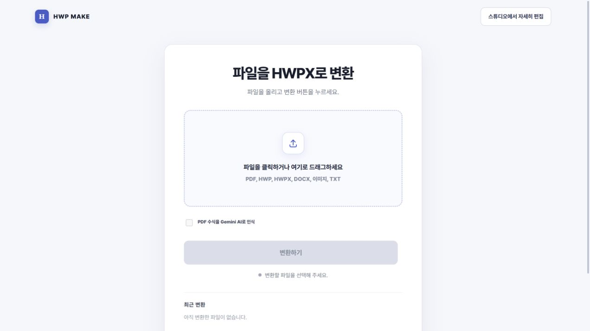
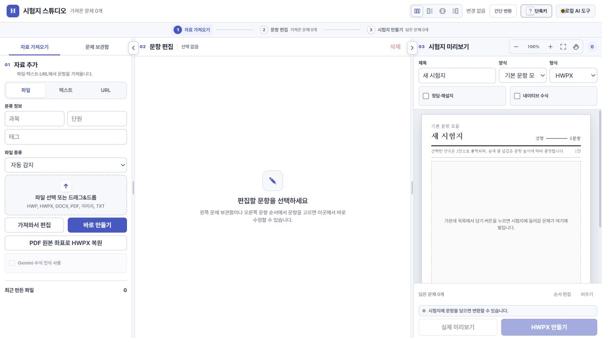
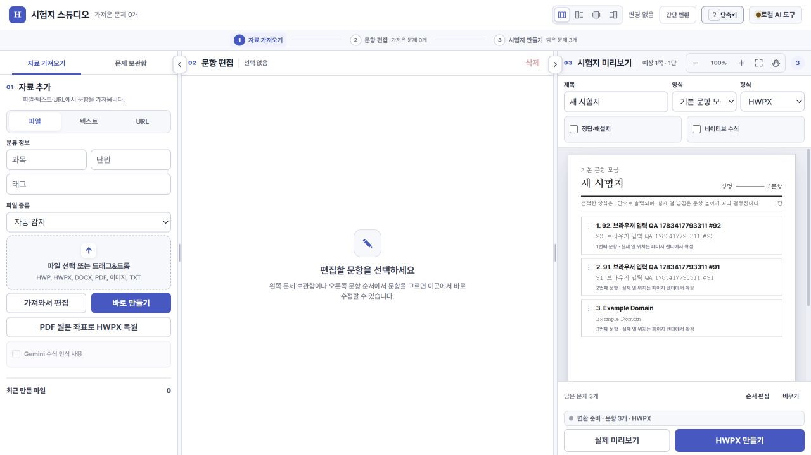
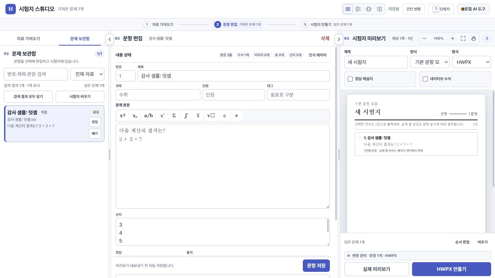
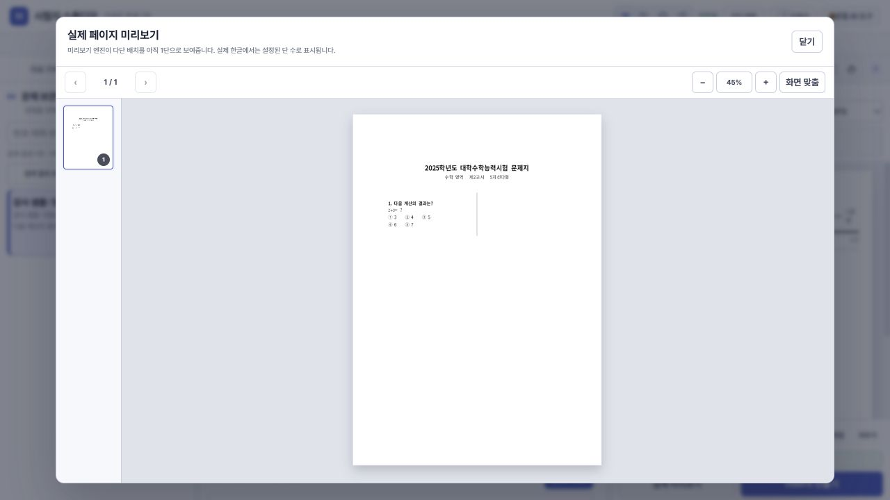
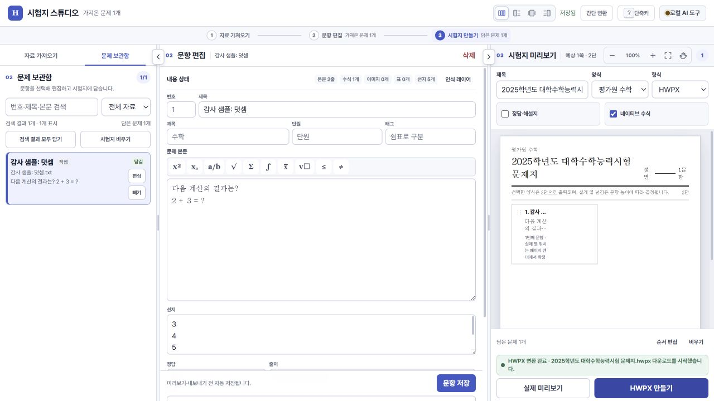
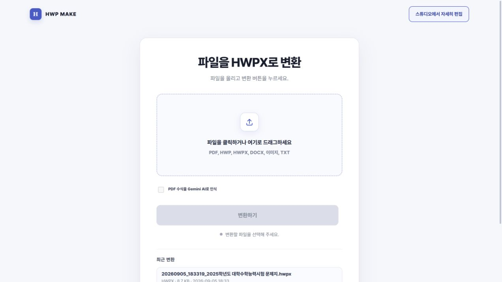

# UI·변환 경험 및 세부 오류 통합 감사

검토일: 2026-09-05 · 기준 커밋: `619a063` · 담당: 주 에이전트 + 독립 서브에이전트 3명.

## 결론

**첫 진입은 간결하고 텍스트 가져오기→편집→HWPX 생성 경로는 작동한다. 그러나 문항 누락, 오류 원인 은폐, 결과와 검수 경로의 단절 때문에 현재 상태를 “P1 없음” 또는 범용 변환 완료로 판단할 수 없다.** 개선 순서는 문항 보존 → 실패·진행 상태 정합성 → 결과 검수 → 화면 밀도·용어 정리다.

이번 요청은 평가와 개선 방향 파악이므로 제품 소스는 변경하지 않았다. 감사 문서·재현 스크립트·화면 증거만 추가했다. 새로운 점수를 임의로 매기지 않았으며 과거 자체평가와 현재 재현을 구분한다.

## 근거와 범위

- UI: Codex 인앱 브라우저로 현재 코드를 실행하고 직접 조작했다. 기본 뷰포트는 약 1280×720이며 캡처별 실제 크기는 PNG를 따른다. 원본 캡처를 저장한 뒤 다시 열어 확인했다.
- 데이터: `tmp/audit-2026-09-05/data`의 격리 DB 사용. 브라우저가 기존 8787 origin의 선택 목록을 복구하는 것을 발견한 뒤 18787의 새 origin에서 정상 경로를 검증했다. 원래 `data/problems.sqlite3`에 테스트 문항을 넣지 않았다.
- 테스트 입력: 직접 만든 덧셈 한 문항, 별도 격리 API 재현 입력, 기존 로컬 검증 샘플. AI 키 없이 실행했으며 원격 AI 호출을 하지 않았다.
- 파일 선택: 브라우저 도구의 `filechooser`가 두 번 timeout되어 간단 모드 PDF 업로드→변환 전체 경로의 시각 검증은 완료하지 못했다. 이 현상을 제품 결함으로 판정하지 않는다. 오류 은폐·진행 중 파일 교체·PDF 결과 연결 문제는 코드 근거이고 실제 UI 재현과 구분한다.
- 실제 한글 GUI 열기·편집, 모바일/200% 확대, 화면 낭독기 전체 동작은 이번에 검증하지 않았다. 접근성 인증이나 전과목 품질 보증이 아니다.

독립 분석: [UI 코드와 행동 계약](ui-code-review.md), [변환 재현 및 검증](conversion-review.md), [과거 평가·낮은 점수·범위 변화](history-review.md).

## 단계별 사용자 경험

| 단계 | 관찰한 화면·행동 | 판정 | 우선 개선 |
|---|---|---|---|
| 1 | 기본 화면: 파일 선택, 변환 버튼, 최근 변환 | 시작 방법은 명확. AI 비활성 이유와 설정 진입은 눈에 보이지 않음 | PDF 선택 후 관련 옵션만 노출, 설정 이유/경로를 인접 표시 |
| 2 | 간단 모드 파일 업로드·변환 | 파일 선택 도구 제약으로 시각 검증 미완료. 코드에서 실패/상태 결함 발견 | 상세 오류 영구 표시, 실제 입력 잠금, 현재 모드 단축키 |
| 3 | 스튜디오 진입: 자료·편집·미리보기 3패널 | 기능은 구분됨. 빈 에디터가 넓고, 세 가지 변환 버튼의 차이가 불명확 | 첫 입력에 집중, “문항으로 편집”과 “원본 배치 변환” 목적별 설명 |
| 4 | 텍스트 가져오기→선지 5개 분리→편집·시험지 자동 추가 | 합성 한 문항 정상. 편집 정보량이 많고 독립 스크롤 사용 | 초급 화면은 본문·선지·정답 중심, 분류/AI/인식 정보 접기 |
| 5 | 평가원 수학 선택→실제 HWPX 페이지 미리보기 | 렌더 성공. 다단 제한 안내 존재. 2단 작업 캔버스의 글자가 좁게 줄바꿈됨 | 구성 보기와 출력 렌더 이름 구분, 출력 엔진/형식/제약 명시 |
| 6 | HWPX 만들기→완료 상태 | 8,908바이트 파일 생성 및 다운로드 시작 안내 확인. OS 저장 완료는 별도 미검증 | 생성·다운로드 시작·사용자 검수 완료를 분리 |
| 7 | 간단 모드 복귀→최근 결과 | 생성 파일 링크 정상 노출. 긴 날짜·파일명 중심이며 첫 화면 아래로 밀림 | 결과 카드에 원본 이름·품질 경고·다시 받기·검수 진입 통합 |

### 1. 기본 화면

주 행동이 하나여서 시작은 쉽다. 반면 AI 체크박스는 비활성이고 “AI 설정에서 연결”은 title에만 있다. 약 720px 높이에서 최대 용량과 자동 다운로드 안내가 첫 화면 밖에 있어 파일을 고르기 전에 제한을 알기 어렵다. 작은 회색 보조 문구와 비활성 사유는 키보드·터치 관점의 추가 확인이 필요하다.

### 3. 빈 스튜디오와 선택 복원

왼쪽은 “자료 가져오기”, 가운데는 편집기인데 오른쪽 빈 안내는 “가운데 목록에서 담기”라고 말한다. 현재 위치와 도움말이 맞지 않는다. “가져와서 편집 / 바로 만들기 / PDF 원본 좌표로 HWPX 복원”은 엔진 차이를 사용자가 해석해야 한다.

위 별도 진단 화면은 빈 격리 DB에 이전 origin의 선택 목록만 복원된 조건이다. “가져온 0개 / 담은 3개”인데 만들기 버튼이 활성화된다. 정상 신규 설치 상태가 아니라 DB 교체·다른 탭 삭제 등에 대응하는 정합성 문제의 재현이다. 서버 재조회 실패를 조용히 무시하는 코드와, 일부 ID가 없을 때 일부만 출력하는 API 재현이 연결된다.

### 4. 가져오기와 편집

입력한 본문과 선지 5개가 분리되었고 시험지에 자동 추가되었다. 저장 상태와 내용 상태가 보여 현재 위치를 알 수 있다. 그러나 한 문항을 편집하는 기본 작업에서도 분류·수식 도구·이미지·AI 정보가 늘어서며, 정답은 중앙 패널 아래쪽에 놓인다. 실제 사용자 시간·성공률을 측정한 결과는 아니다.

### 5. 출력 미리보기

한 페이지 렌더와 확대·화면 맞춤·초점 복귀는 동작했다. 화면 자체가 “다단 배치를 아직 1단으로 보여준다”고 안내한다. 이 합성 한 문항으로 실제 다단 차이의 크기를 측정한 것은 아니다. 현재 명칭의 “실제”가 최종 한글 출력과 동일하다는 뜻으로 받아들여지지 않게 해야 한다.

### 6–7. 생성 완료와 최근 파일

생성 파일과 이력이 연결된다. 다만 2단 구성 캔버스는 작은 오른쪽 패널에서 제목·본문을 너무 좁게 압축한다. 최근 결과에는 다운로드 링크가 있지만 품질 상세나 원본 대조로 이어지는 경로가 없다. 기본 수학 양식은 2025학년도 제목을 채우므로 현재 사용자가 매번 연도/시험명을 확인해야 한다.

## 우선순위와 완료 기준

| 순서 | 문제·근거 수준 | 영향 | 구체 개선 | 완료 기준 |
|---|---|---|---|---|
| P1-1 | 없는 ID를 섞은 내보내기 HTTP 200, API 재현 확정 | 일부 문항 누락에도 완료. UI는 요청 개수로 성공 안내 | 모든 요청 ID를 확인하고 누락 목록 반환, basket의 오래된 항목 표시 | 요청·출력 문항 ID/개수/순서가 일치하거나 명시적 실패. 조용한 부분 출력 0 |
| P1-2 | 같은 CSV의 `f(x)`/`f(X)`가 하나로 처리됨, API 재현 확정 | 수학 의미가 다른 문항 소실 | 대소문자 보존 중복 기준, 출처·내용·구조별 판단 분리 | 두 문항 모두 보존. 같은 파일 재가져오기와 다른 출처 동일문항도 별도 회귀 |
| P1-3 | 간단 모드 toast/modal CSS 숨김, 코드 확인 | 실패 원인·경고가 사라짐, 숨겨진 단축키 상태 | 현재 화면에 오류/회복 행동 유지, 모드별 명령 연결 | 400/413/429/500/단절/취소 각각 원인과 다음 행동 표시 |
| P1-4 | 실행 중 input에 실제 disabled 없음, 코드 확인 | A 변환 중 B 이름·준비 상태 노출 가능 | 입력 스냅샷과 작업 ID, 실제 input 잠금 | 마우스·키보드·drop 경로 모두 현재 작업 파일명/점수 유지 |
| P1-5 | 품질점수만 표시하고 경고·미검증 범위 누락, 코드 확인 | 생성 성공을 품질 검수 완료로 오해 | “생성 완료 / 검수 필요 / 확인 불가” 및 근거 항목 표시 | 시각 미검증·fallback·목표 미달을 성공 점수로 가리지 않음 |
| P1-6 | 합본 40쪽→20쪽 자동 축약, 실물 API 재현 | 사용자가 전체 변환을 기대하면 범위 축소. 선지가 다른 유형도 제거 가능 | 전체/단일 유형 선택과 제외 범위 명시, 선택한 원본 범위로 검수 | 전체 유지 시 모든 유형 보존, 단일 유형은 선택 범위·제외 문항 공개. 점수만 높이는 수정 금지 |
| P2-1 | PDF 완료→스튜디오는 모드 전환뿐, 코드 확인 | 결과 편집·검수가 끊김 | 결과별 원본·HWPX·리포트를 여는 검수 화면 | 같은 작업의 결과를 한 번에 열고 이전 시험지와 혼동하지 않음 |
| P2-2 | 슬롯 포화가 429→500, API 재현 확정 | 대기 가능한 상태를 서버 실패로 오해 | HTTPException 보존, 재시도 가능 상태 제공 | 3개 변환 API의 포화 응답이 429, UI 안내/재시도 일치 |
| P2-3 | 다단 미리보기 제한·작은 캔버스·오래된 안내, 직접 관찰 | 문항 배치와 최종 형태 판단이 어려움 | 구성 목록/출력 렌더 분리, 현재 위치에 맞는 도움말 | 지원 조건 내 문항·수식·선지 읽기 가능, 명칭과 실제 동작 일치 |

비동기 목록 갱신 중 최신 편집 내용 덮어쓰기 후보는 별도 지연 재현이 필요하다(UI-06). 확정 손실처럼 집계하지 않는다.

## 권장 사용자 경로

1. 파일 선택: 파일명·종류·용량, 지원 여부와 필요한 기능을 바로 표시한다.
2. 변환 목적 확인: 기본은 빠른 변환. 문항 재구성과 원본 배치 보존의 차이만 필요한 시점에 설명한다.
3. 처리 중: 현재 파일명을 고정하고 업로드·변환·검수 상태를 보여준다. 취소가 요청 중단인지 실제 작업 중단인지 일치시킨다.
4. 결과: 파일 생성 여부, 검수 필요 여부, 편집 가능/이미지 대체 영역을 같은 결과 카드에 둔다.
5. 다음 행동: 다시 받기, 원본과 비교, 해당 결과를 편집. 어느 버튼도 이전 작업을 방금 결과처럼 열지 않는다.

## 점수 해석과 개선 운영

2026-08-18 문서의 UI 97.6/100은 당시 자체평가다. 같은 문서의 structured 수학 91.3점(목표 96), “수식 높이 부족 1,009건”과 측정 대상이 다르다. 이를 합쳐 현재 제품 점수로 쓰지 않는다.

**이번 실물 재변환에서 과거 1,009건의 해석을 정정할 근거를 찾았다.** 현존 25수능 수학 PDF를 structured·AI off로 처리한 결과는 182.643초, HTTP 200, objective 91.3/96, 선택된 유형의 문항 46/46, 네이티브 수식 281개, placeholder 0이다. 이 46/46은 원본 합본 전체의 보존율이 아니다. 문단·셀 높이 부족은 각각 0이고, 집계된 1,009건은 모두 `figure_not_safe_inline`이다. 좌표 배치용 overlay 이미지를 인라인 그림 기준으로 검사한 결과이므로 실제 수식 높이 부족 1,009건으로 보고하면 잘못된 개선 작업을 하게 된다. 이것이 모든 실제 렌더·편집 결함이 없다는 증거는 아니다.

또한 writer의 `variant_page_limit=20`은 원본 40쪽에서 출력 대상 20쪽을 택하지만 fidelity는 원본 40쪽과 출력 20쪽의 차이를 페이지 불일치로 평가한다. 첫 240자 stem/번호의 겹침에 기반한 축약이고 선지 순서 차이는 판단에서 빠지므로, 나머지 유형이 모두 불필요한 중복이라고 결론 내릴 수 없다. 사용자의 범위 선택, 제외 문항 안내, 해당 범위에 맞는 검증 계약이 함께 필요하다. 원시 근거는 [실물 재변환 JSON](real-math-current.json), 세부 해석은 [변환 감사](conversion-review.md)다. 과거 원본의 해시가 없어 당시와 동일한 바이트인지까지 입증한 재현은 아니다.

최근 파일의 harsh 점수와 detailed 점수도 산식이 다르다. 격자 정렬·팽창 허용으로 높은 점수가 나와도 문자·수식의 세부 일치가 같은 수준이라는 뜻은 아니다. 평균 외에 과목별 최저 페이지, 누락/중복, 잘못된 변수·첨자, 수식 높이, 겹침, 이미지 대체 범위를 별도 출고 조건으로 둔다.

권장 개발 묶음은 (A) 문항 무손실과 실패 표시, (B) 작업·결과 상태와 검수 경로, (C) 세부 품질·샘플 범위·화면 밀도다. 문서에는 완료/부분 완료/미검증과 커밋·샘플·측정일을 같이 기록한다. 문자열이 존재하는지 검사하는 프런트 테스트와 실제 표시·실패 복구·입력 보존 행동 검증을 구분한다.

추천 출시 조건은 “전체 평균 96점” 하나가 아니라, **요청 문항 무손실 + 의미 보존 + 검사된 범위의 명시 + 지원 환경에서의 열기·편집 확인**을 모두 만족하는 것이다.

## 이번 검증 결과

- 스튜디오 합성 문항: 가져오기·본문/선지 분리·시험지 추가·평가원 수학 양식·미리보기·생성 완료·최근 파일 링크를 브라우저에서 확인했다.
- 생성 HWPX: ZIP CRC 오류 없음, XML 6개 파싱 성공. 다운로드 시작 안내와 서버 산출물은 확인했지만 실제 한글 GUI에서 편집하지 않았다.
- 기존 제한 검증: API 하드닝, PDF 레이아웃 API, 수식 구조 42개, 자동탐색 수식 높이 fixture 4개, 프런트 간단 변환/접근성 계약이 통과했다. 각 범위와 한계는 독립 보고서에 기록했다.
- 결함 재현: 중복 해시 대소문자 손실, 없는 ID의 무경고 제외, 변환 혼잡의 HTTP 500 재포장, 실패 PDF 업로드 잔류를 격리 API로 확인했다.
- 현재 실물 재변환: 위 JSON 결과와 같이 수행했다. 통합 전체 suite 재실행이나 모든 저점 페이지의 새 육안 검수는 수행하지 않았다.
