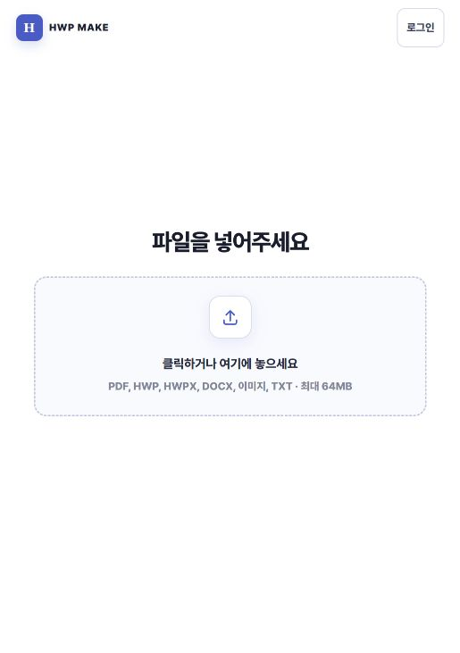
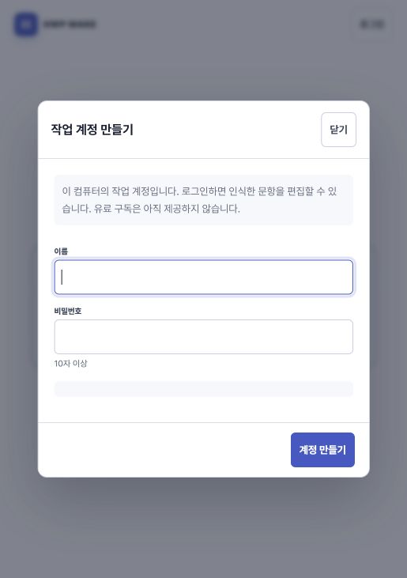

# HWP Make 로컬 앱·프리미엄·화면 비교 검토

2026-09-07. 현재 작업 트리 기준. 비교 대상은 이 저장소 안의 Windows Basic, 로컬 브라우저 기본 변환/프리미엄, 별도 웹 프로토타입이다. 외부 경쟁 서비스 비교는 포함하지 않는다.

**판정: 기본 변환과 고급 편집의 제품 분리는 명확하다. 프리미엄의 핵심 번호 처리 기술은 관련 검증을 통과했지만, 유료 서비스로 운영할 저장·권한·결제 연결은 아직 남아 있다. 다음 개발의 중심은 시험지별 초안과 재편집이다.**

이번 작업은 검토와 검증이며 제품 코드는 수정하지 않았다. 기존 작업 트리 변경도 유지했다. 검토 서버는 `HWP_MAKE_DATA_DIR=tmp/audit-20260907-local`을 사용해 기존 문제은행과 분리했다.

| 대상 | 현재 확인한 범위 | 장점 | 남은 일 |
| --- | --- | --- | --- |
| Windows Basic | `run_desktop.py`, `app/desktop_convert.py`, 배포 설정·산출물 존재 확인. 네이티브 창은 이번에 캡처하지 못함 | 로그인·API 키 없는 단일 파일 변환, HWPX/DOCX 선택, 저장 위치·최근 기록·결과 열기 | 설치본 실행·작은 화면·실제 문서 결과를 연결한 GUI 검증. 기본/프리미엄의 브랜드·문구 일관성 |
| 로컬 브라우저 기본 | `/`, `/premium`, `/premium/studio`가 같은 입력 화면을 제공. 실제 첫 화면·계정 창 캡처 | 입력만 있는 시작, 인식 뒤 다음 동작을 보여 주는 구조 | 첫 화면에서 산출 형식·로컬 처리를 알기 어려움. 지원 형식 안내의 대비 부족 |
| 로컬 프리미엄 | 코드와 번호·API·인증·프런트 검증. 편집 화면의 이번 실행 캡처는 미완료 | 문항 선택·순서 편집·원번호 유지·1~999 연속 번호, 본문/정답표/해설 번호 연동, HWPX/DOCX | 시험지별 저장·복제·버전·내용 스냅샷, 웹 계정 연결, 실제 이용권·결제 |
| 별도 웹 프로토타입 | `app/web_*`, `static/web`, 관련 pytest 14개 통과. 이번 화면 캡처는 하지 않음 | 사용자별 파일/작업 소유권, 영속 변환 대기열, 취소·재시도·다운로드 | 프리미엄 편집 모델과 연결. 외부 서비스 운영 및 결제 출시 검증 |

`/api/premium-capabilities`는 `mode=local_preview`, `billing_enabled=false`를 반환한다. 로컬 로그인은 유료 이용권을 의미하지 않는다. Windows 배포본에는 웹 스튜디오가 포함되지 않는다(`packaging/basic-static/README.txt`, `packaging/basic.spec`).

**실제 화면과 사용자 흐름**

1. **파일 입력 — 부분 양호.** 515×731 브라우저 영역에서 로고·로그인·입력 영역의 계층이 명확하고 가로 넘침이 없었다. 제목과 입력 영역의 목적이 겹치는 반면, HWPX로 무엇이 만들어지는지와 이 컴퓨터에서 처리된다는 정보는 첫 화면에 없다. 입력만 유지하는 방향을 보존하면서 제목을 `파일을 HWPX로 변환`으로 조정하거나 짧은 보조 문구로 목적을 설명하는 안을 제안한다. 큰 기능 소개나 요금표를 첫 화면에 추가할 필요는 없다.

2. **로컬 작업 계정 진입 — 대체로 양호.** 단일 작업 계정이고 유료 구독은 아직 없다는 설명이 있다. 이름 입력에 포커스가 이동하고 Escape로 닫으면 로그인 버튼에 포커스가 돌아왔다. 첫 계정 생성 상황인데 진입 버튼은 `로그인`이고 창 제목은 `작업 계정 만들기`여서 상태에 맞는 버튼 명칭을 검토할 수 있다. 전체 폼 오류·키보드 순환·비밀번호 복구는 이번 화면 점검에서 검증하지 않았다.

3. **파일 업로드·인식 — 브라우저 검증 차단.** 새로 작성한 합성 TXT를 이용하려 했지만 in-app Browser와 대체 Chrome 모두 파일 선택 이벤트를 받지 못했다. 사용자 파일은 업로드하지 않았다. 앱의 업로드 실패로 확정할 수 없는 도구 제한이다. 현재 도구는 네이티브 앱 제어도 비활성화되어 Windows 파일 선택 창으로 이어갈 수 없었다.

4. **문항 편집·출력 — 기능 검증 통과, 시각 검증 미완료.** 아래 관련 스크립트에서 실제 번호 변환과 HWPX/DOCX 패키지 내용을 확인했다. 실제 브라우저의 드래그, 편집 패널 밀도, 미리보기 모달, 다운로드까지 이어지는 흐름과 한글/Word에서의 렌더는 이번 결과로 보증하지 않는다.

Chrome 업로드 도구의 공식 복구 안내: To enable file upload, open chrome://extensions, click Details under the ChatGPT browser extension, and enable "Allow access to file URLs." See [here](https://developers.openai.com/codex/app/chrome-extension#upload-files) for details. 이 설정은 이번 작업에서 변경하지 않았다.

**확인된 문제와 개선 우선순위**

| 우선순위 | 근거와 사용자 영향 | 구체적 개발 범위 | 완료 조건 |
| --- | --- | --- | --- |
| P1 · 가독성 | 1번 화면의 지원 형식·64MB 안내는 12px, 글자 `#7c879a`, 배경 `#f8faff`. 계산 대비 약 3.47:1 | 기존 muted 색상 체계 안에서 안내문 색을 진하게 조정하고 폰트 크기·줄바꿈 확인 | 작은 정보성 텍스트 대비 4.5:1 이상, 좁은 화면에서 안내 누락 없음 |
| P1 · 시험지별 저장 | `static/app.js:1477`의 바구니와 `:1503`의 번호 복원은 브라우저 단일 키 기반. 여러 시험지의 독립 저장 모델이 아님 | 시험지 ID, 제목, 문항 목록/순서, 번호 규칙, 양식, 정답지 옵션, revision 저장. 새 시험지와 이전 작업 재개를 구분 | 서로 다른 시험지 2개를 저장·복원해 순서·번호·양식이 각각 일치 |
| P1 · 원본과 초안 구분 | `static/app.js:2331`의 문항 자동저장은 `/api/problems/{id}`를 수정. 번호 출력은 원본 복사본을 쓰지만 본문 편집은 문제은행 수정 | 시험지 문항 스냅샷과 원본 출처 ID를 분리. 원본 수정과 현재 시험지 수정의 의미를 명확히 표시 | 초안 본문을 바꿔도 다른 시험지 및 원본 문항 내용이 바뀌지 않음 |
| P1 · 생성 전 확인 | 코드에 순서·번호·정답지·출력 옵션이 존재. 실제 완성본과의 연결이 상품 가치 | 생성 직전 문항 수, 출력 번호 범위, 정답 누락, 지원 불가 문항과 검수 필요 항목을 한곳에 표시 | 선택 순서·번호와 본문·정답표·해설 일치, 미해결 항목은 결과에서 확인 가능 |
| P2 · 프리미엄 화면 집중도 | `static/index.html`에는 자료·본문·구성 3개 패널 외에 AI 도구와 다수 내보내기 옵션이 있음. 밀도 문제는 코드상 검토 가설이며 렌더 확인 필요 | 화면 캡처를 먼저 완료한 뒤 기본 편집 동작을 우선 배치. AI/OCR·세부 출력 설정은 필요 시 펼침. 원번호→출력 번호를 동일한 표현으로 통일 | 일반 사용자가 문항 선택→순서 변경→21번부터 생성 흐름을 도움 없이 완료 |
| 유료 출시 전 필수 · 웹 연결 | 로컬 계정과 `app/web_store.py`의 웹 계정/작업은 별도. 웹 모델에는 users/sessions/jobs 등이 있으나 시험지·이용권 연결이 없음 | 검증된 웹 소유권/대기열에 시험지 저장·생성 작업을 연결하고 이용권 검사를 서버에서 적용. 이후 결제 상태·만료 처리 연결 | 두 계정 자료 격리, 권한 만료·실패·재시작 복구, 생성과 다운로드 정책 검증 |

대비 기준은 [W3C WCAG 2.2 SC 1.4.3 해설](https://www.w3.org/WAI/WCAG22/Understanding/contrast-minimum.html)을 참고했다. 12px 텍스트는 굵게 표시되더라도 이 기준의 큰 글자 예외에 해당하지 않는다. 위 한 요소의 대비 확인은 앱 전체 접근성 인증이 아니다.

추가로 **새 파일에서 시작 번호가 이전 시험지의 값으로 복원될 가능성**을 확인할 필요가 있다. `enterPremiumEditor`는 새 파일 진입 후에도 `initializePremiumEditor`→`restoreNumbering`을 호출한다(`static/app.js:4392`, `:4445`). 이는 코드 경로에서 도출한 점검 항목이며 이번 실제 브라우저에서 재현한 오류로 기재하지 않는다. 새 시험지는 1부터, 이전 작업 재개는 저장값 복원이라는 기획을 구분해 검증해야 한다.

**추천 개발 순서**

1. 첫 화면 안내 대비·출력 목적·계정 명칭을 작은 변경으로 정리한다. 업로드 도구 문제를 해결한 환경에서 편집과 결과 화면을 캡처한다.
2. 프리미엄에 시험지별 초안 저장·복제·번호 설정·내용 스냅샷을 도입한다. 새 작업/재개 기본값과 원본 보호를 함께 해결한다.
3. 생성 전 검수와 결과 이력을 연결한다. 사용자에게 `원본 27번 → 출력 1번 → 정답표 1번`이 일치함을 보여 준다.
4. 별도 웹 프로토타입의 사용자·소유권·영속 작업 기반에 프리미엄을 이식한다. 소유권/권한 검증 후 이용권·결제·만료 처리를 개발한다.
5. 공유 지문 묶음·A/B 시험지·AI 확장은 위 흐름이 안정된 후 진행한다. 현재 유료 혜택으로 구현 전 기능을 안내하지 않는다.

**이번 실행 검증**

| 명령 | 결과와 범위 |
| --- | --- |
| `python scripts/verify_premium_numbering.py` | PASS. 원번호/연속 번호, 경계·지원 제한·원본 복사본, 실제 두 형식 본문/정답/해설 검사 |
| `python scripts/verify_premium_api.py` | PASS. 실제 세션, 비로그인 차단, HWPX/DOCX 출력과 DB 보존. 미리보기 렌더러는 대역이므로 실제 미리보기 품질 검증 아님 |
| `python scripts/verify_local_auth.py` | PASS. 계정·로그인·로그아웃, 출처/로컬 검사, 세션 회전·만료, 비밀번호 저장·시도 제한·동시 초기화 |
| `node scripts/verify_premium_frontend.js` | PASS. 실제 함수와 격리된 브라우저 경계로 번호·복원·내보내기 정책 검사 |
| `node scripts/verify_progressive_entry.js` | PASS. 단계별 진입·인식·로그인 중 파일 유지·명시적 편집·경합·재시도 |
| `node scripts/verify_frontend_accessibility.js` | PASS. 정적 접근성 계약 검사. 실제 첫 화면 대비 미달을 발견했으므로 전체 접근성 통과로 해석 불가 |
| `python -m pytest scripts/verify_web_prototype.py -q` | 14 passed in 10.88s. 격리된 계정·파일·실제 변환을 쓰는 웹 프로토타입 검증 |

문서 패키지 검사 중 manifest 일부를 파일 탐색으로 보완하는 경고가 있었지만 관련 검증은 종료 코드 0이었다. 전체 통합 러너, 새 실물 PDF 전과목 품질, Windows 설치/네이티브 GUI, 실제 한글/Word 재열기는 이번에 실행하지 않았다. 과거 문서의 97.6점 등 자체 평가는 이번 시점의 점수로 재사용하지 않았다.

소스 참조: `run_desktop.py`, `app/desktop_convert.py`, `app/main.py`, `app/local_auth.py`, `static/index.html`, `static/styles.css`, `static/app.js`, `app/web_main.py`, `app/web_store.py`, `docs/premium_studio_product_plan.md`. 캡처는 같은 폴더에 저장했고 저장된 이미지 파일을 다시 열어 확인했다.
