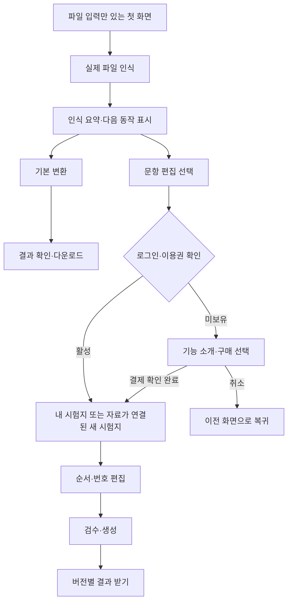

# 프리미엄 시험지 스튜디오 심화 기획

작성일: 2026-09-07 · 브랜치: `codex/premium-reorder-numbering` · 상태: 단계적 진입·로컬 로그인·순서/번호 편집 미리보기 구현

구현 진행: 모든 진입 경로는 간단한 파일 입력으로 시작한다. 파일 인식 후 로그인과 명시적인 편집 선택을 거쳐 일반 문항의 순서·번호 편집으로 확장한다. [구현 범위](premium_studio_implementation.md)를 참고한다. 이 문서 전체의 저장·구독·결제·웹 권한이 구현된 것은 아니다.

## 1. 제품 방향과 결정 범위

**문제 순서 편집, 출력 번호 변경, 정답·해설 번호 동기화는 별도 프리미엄 작업 공간에서 제공한다.** 기본 변환 화면에는 해당 편집 도구를 추가하지 않는다. 교사·강사가 가지고 있는 자료로 새 시험지를 구성하고, 번호를 다시 맞추는 반복 작업을 줄이는 것이 유료 제품의 핵심 가치다.

사용자가 확정한 방향은 ‘고급 편집 기능의 프리미엄화’, ‘기본 UI에서 분리’, ‘입력만 있는 첫 화면과 파일 인식 후의 단계적 확장’이다. 화면과 로컬 로그인은 구현했고, 구독 방식·만료 처리·출시 단계는 후속 제안이다. 요금이나 결제 사업자는 확정하지 않는다.

기술 가능 여부와 기존 실행 검증은 [확장 검토](premium_reorder_numbering_assessment.md)를 따른다. 제품 위치·기본값은 이 문서를 우선한다. 기존 [웹 전환 기획](web_service_plan.md)의 ‘고급 경로’는 향후 웹 제품에서 이 프리미엄 영역으로 배치하며, 사용자별 자료 보호·작업 대기열 등 웹 기반은 그대로 선행 조건이다.

## 2. 기본 기능과 프리미엄 기능의 경계

| 사용자 작업 | 기본 변환 | 프리미엄 스튜디오 |
| --- | --- | --- |
| 파일 업로드·변환·상태 확인 | 제공 | 기본 기능을 함께 이용 |
| 원래 순서·번호를 유지한 결과 받기 | 제공 | 제공 |
| 결과의 품질 안내·주의사항·다운로드 | 제공 | 제공 |
| 자료를 문항으로 가져와 새 시험지 구성 | 기본 UI에 미노출 | 제공 |
| 문항 선택·제외·순서 이동 | 기본 UI에 미노출 | 제공 |
| 순서에 따른 자동 번호·시작 번호·원번호 유지 | 기본 UI에 미노출 | 제공 |
| 새 순서에 맞춘 정답표·해설 번호 동기화 | 기본 UI에 미노출 | 입력에 정답·해설이 있는 범위에서 제공 |
| 시험지 초안 저장·재편집·복제 | 기본 UI에 미노출 | 제공 |
| 시험지 양식·HWPX/DOCX 생성 | 기본 변환의 기존 출력 범위 유지 | 선택 문항으로 새 문서 생성 |
| 공유 지문 묶음·임의 번호·여러 버전 제작 | 기본 UI에 미노출 | 후속 단계 |

기본 출력의 수식·텍스트 품질을 인위적으로 낮추거나 기존 다운로드를 결제 화면으로 가리지 않는다. 유료 가치로 판매하는 것은 ‘새 시험지를 구성하고 반복 편집하는 기능’이다. 기본 기능의 무료 한도는 별도 운영 정책이며 이 문서에서 무제한 제공을 약속하지 않는다.

정답·해설 동기화는 제공된 정답과 해설을 문항에 맞춰 이동·표기하는 기능이다. 정답 추론이나 해설 자동 생성은 포함하지 않는다.

## 3. 주요 사용자와 완료 경험

초기 대상은 편집 가능한 디지털 문항을 가진 교사·강사다. 스캔본만 보유한 사용자를 첫 유료 출시의 주 대상으로 삼지 않는다.

| 상황 | 사용자가 할 일 | 완료 경험 |
| --- | --- | --- |
| 여러 기출에서 복습 시험지 만들기 | 자료별 문항을 선택하고 원하는 순서로 배치 | 1번부터 정돈된 문제지와 일치하는 정답·해설 |
| 시험지를 특정 번호부터 이어 만들기 | 시작 번호를 21로 설정 | 본문·정답표·해설 모두 21부터 시작 |
| 기존 수업 자료를 다시 활용하기 | 저장된 시험지를 복제하고 일부 문항 교체 | 원본 초안을 보존한 새 시험지와 별도 결과 |
| 원래 문제 번호로 수업 진행하기 | 번호 방식을 ‘원번호 유지’로 변경 | 원번호와 출처를 유지한 구성; 중복 원번호는 검수에서 확인 |

‘완료’는 파일 생성만을 뜻하지 않는다. 선택한 문항 수·순서·번호가 결과와 일치하고, 수식·그림 등 검수 항목이 사용자에게 전달되어야 한다.

## 4. 진입과 정보 구조

아래 표는 유료 웹 제품의 후속 경로 제안이다. 현재 로컬 구현의 `/`, `/premium`, `/premium/studio`는 모두 같은 간단 입력 상태로 시작하며 URL만으로 편집기를 열지 않는다.

| 영역 | 경로 예시 | 주 역할 |
| --- | --- | --- |
| 기본 변환 | `/` | 업로드 → 변환 → 결과 |
| 프리미엄 소개 | `/premium` | 실제 기능 예시·지원 범위·플랜·구매 진입 |
| 내 시험지 | `/premium/exams` | 초안·최근 생성물·새 시험지 |
| 시험지 편집 | `/premium/exams/{id}` | 자료 추가·순서·번호·미리보기 |
| 시험지 결과 | `/premium/exams/{id}/outputs/{output_id}` | 특정 버전의 결과·번호 목록·검수·다운로드 |
| 이용권 관리 | `/account/plan` | 이용 상태·다음 갱신일·결제 내역·해지 진입 |

첫 화면에는 로고, 로그인, 파일 입력만 둔다. 로그인한 경우에도 파일을 넣기 전에는 같은 화면을 유지한다. 파일 인식에 성공하면 인식 요약과 기본 변환·문항 편집을 표시한다. 문항 편집을 선택하면 로그인 상태와 이용권을 확인하고 확장한다. 로컬 미리보기는 로그인만 검사하며 실제 유료 이용권 검사는 출시 전 별도로 구현한다. 번호 설정, 잠긴 편집 패널, 요금제 비교표를 기본 변환 폼 안에 넣지 않는다.

유료 사용자가 기본 화면을 방문해도 기본 화면은 유지한다. 프리미엄 진입을 선택했을 때만 작업 공간으로 이동한다. 기존 `hwpMakeUiMode` 값이나 URL만으로 프리미엄 편집이 열리지는 않는다.

자료에서 진입한 경우 결제·로그인 후 원래 선택 자료로 돌아온다. 서버에 소유권을 확인한 파일 ID와 복귀 의도만 보관하고 원본 파일을 URL에 넣지 않는다. 자료가 만료됐으면 재업로드를 안내한다. 구매 취소 시 기본 변환 결과는 그대로 받을 수 있다.

## 5. 프리미엄 전용 화면 설계

### 5.1 소개와 구매 전 체험

첫 문장은 ‘필요한 문제를 골라, 번호까지 맞춘 새 시험지를 만드세요’로 제안한다. 서비스 제공 샘플의 `원본 27번 → 출력 1번` 사례와 정답표가 함께 바뀌는 짧은 예시를 보여준다. 체험은 서비스 샘플로 한정하고 개인 자료의 유료 편집 작업을 무료 API로 실행하지 않는다.

구매 전에 지원 파일·편집 가능한 문항의 조건, 이미지 속 번호와 공유 지문의 제한, 포함된 생성량과 저장 한도를 표시한다. 구현·검증되지 않은 기능은 ‘예정’으로 구분하고 현재 이용권의 혜택으로 판매하지 않는다. 실제 출시 전까지 임의 가격과 할인율을 표시하지 않는다.

### 5.2 내 시험지

주 동작은 ‘새 시험지 만들기’다. 목록은 제목, 문항 수, 최근 저장 시각, 최근 결과, 상태를 표시한다. 상태는 ‘초안 / 생성 중 / 생성 완료 / 확인 필요’로 구분한다. 빈 상태는 자료를 추가해 첫 시험지를 만들도록 안내한다.

복제는 초안과 문항 스냅샷을 복사하되 새 시험지 ID를 부여한다. 삭제는 시험지 초안과 그 결과에 적용하며 원본 문항함의 문항을 함께 삭제하지 않는다. 실제 보관 기간과 삭제 처리는 웹 파일 정책에 맞춘다.

### 5.3 시험지 편집

PC에서는 기존 스튜디오의 자료·편집·미리보기 구조를 재사용한다. 상단에는 시험지 제목, 저장 상태, ‘기본 변환으로’, ‘검수 후 만들기’를 둔다. 기존 색상·글꼴·포커스 규칙을 유지하고 Premium 표시와 전용 내비게이션으로 구분한다. 별도의 시각 시안 제작은 이 문서 범위 밖이다.

| 위치 | 내용 | 주요 상호작용 |
| --- | --- | --- |
| 왼쪽 자료 목록 | 내 자료·문항 검색·출처·원번호 | 문항 선택·추가, 지원 여부 안내 |
| 가운데 시험지 구성 | 순서 카드·출력 번호·원번호·짧은 본문 | 드래그, 위아래 이동, 위치 지정, 제거, 실행 취소 |
| 오른쪽 설정·미리보기 | 번호 방식·시작 번호·양식·정답/해설·예상 배치 | 옵션 변경, 예상 배치 갱신, 렌더 미리보기 |

순서 카드의 큰 숫자는 출력 번호다. 보조 정보는 ‘원본 27번 · 자료명 · 3쪽’처럼 표시한다. 원번호 유지 모드에서는 목록 위치를 ‘배치 1’로 따로 표시해 번호와 순서를 혼동하지 않게 한다.

새 프리미엄 시험지는 ‘순서대로 번호 매기기 / 1부터’를 기본값으로 제안한다. 저장된 시험지는 마지막 설정을 복원한다. ‘원번호 유지’ 선택 시 시작 번호 입력은 비활성화한다. 설정은 이 시험지에만 적용하며 기본 변환과 문제은행 원본에는 전파하지 않는다.

번호·순서 변경은 화면에 즉시 반영하고 서버 저장 완료 후에만 ‘저장됨’을 표시한다. 실행 취소는 이동·제거·번호 정책 변경을 한 동작씩 되돌린다. 순서 이동마다 키보드 사용자에게 ‘원본 27번을 첫 번째로 이동, 출력 1번’처럼 결과를 알린다. 드래그 외에 이동 버튼과 위치 지정으로도 모든 순서 작업이 가능해야 한다.

모바일 첫 버전은 한 번에 한 패널만 표시하고 이동 버튼·위치 지정으로 순서를 편집한다. 페이지 확인과 상세 문항 편집은 PC에서 더 편리하다는 안내를 제공한다. 터치 드래그와 PC 수준의 정밀 페이지 조작은 출시 보장 범위에 포함하지 않는다.

### 5.4 검수와 결과

생성 전에는 문항 수, 번호 범위, 양식, 포함할 정답·해설, 확인이 필요한 항목을 요약한다. ‘20문항 · 1~20번 · 정답표 포함 · 해설 17개’처럼 실제 입력을 표시하고 없는 해설을 생성된 것으로 표현하지 않는다.

치명적인 불일치가 없으면 렌더 미리보기와 생성으로 진행한다. 예상 배치는 추정치이며 현재 HWPX 미리보기의 다단 제약을 명시한다. DOCX도 HWPX 기준으로 미리보기한다면 해당 사실을 표시한다.

결과에는 ‘시험지 v3’와 생성 시점의 번호 대응 목록, 포함 문항 수, 검수 주의사항을 제공한다. 초안을 수정해도 v3 결과는 바뀌지 않는다. 다운로드한 시험지를 재현할 수 있도록 결과마다 원본 문항 ID·출력 번호·내용 스냅샷을 연결한다.

## 6. 번호·이동 규칙

| 항목 | 첫 출시 규칙 |
| --- | --- |
| 연속 번호 | 선택된 일반 문항만 순서대로 계산. 시작 1~999, 마지막 번호 999 이하 제안 |
| 원번호 유지 | 원번호가 비어 있으면 자동으로 섞어 채우지 않고 수정 필요 표시. 같은 원번호가 있으면 출처를 보여주고 확인 후 생성 허용 |
| 번호 변경 단위 | 시험지 항목의 출력 번호. 문제은행 `number`는 유지 |
| 본문에 남은 번호 | 인식된 원번호 접두사만 정리. 소수·수식·자유 참조는 일괄 치환하지 않음 |
| 정답·해설 | 문항 항목에 연결해 함께 이동. 선지 순서는 유지 |
| 반복 삽입 | 동일 원본 문항은 한 시험지에 한 번만 추가. 초기 API의 중복 금지와 일치 |
| 여러 문항 이동 | 1차는 개별 이동·위치 지정. 다중 선택 이동은 후속 |
| 임의 번호 | 1차는 연속/시작/원번호만 지원. 문항마다 임의 숫자 입력은 2차 |
| 공유 지문·이어지는 조각 | 1차에서 자동 번호 지원을 약속하지 않음. 관계가 확인되지 않으면 편집 생성 차단 |
| 이미지 속 번호·좌표 보존 문서 | 자동 재번호 대상 제외. 편집 가능한 문항으로 변환·검수하거나 기본 원본 변환 이용 |

원번호 중복을 허용하는 경우 검수·번호 대응 목록에서 출처로 구별한다. 서로 다른 문항의 출력 번호가 같은 상태를 정상적인 연속 번호 결과로 만들지는 않는다.

공유 지문 2차 구현에서는 지문과 소속 문항을 하나의 묶음으로 이동하고, 지문 자체는 문항 수·정답표에서 제외한다. 범위 `[21~23]`은 소속 문항의 출력 번호로 계산한다. 묶음을 비연속으로 나누는 동작은 최초 그룹 버전에서 막는다. 임의 번호로 범위를 표현할 수 없는 경우도 저장 전 확인해야 한다.

## 7. 저장·실패·복구 경험

| 상태 | 화면과 행동 |
| --- | --- |
| 아직 문항이 없음 | 자료 추가 안내. 생성 비활성 |
| 문항 지원 여부 확인 중 | 확인 중 표시. 불명 상태를 지원으로 간주하지 않음 |
| 미지원 문항 포함 | 해당 카드와 이유 표시. 제거·수정·기본 변환 이동 중 선택 가능; 조용히 누락하지 않음 |
| 저장 중·오프라인 | 저장 중 또는 연결 끊김 표시. 서버 확정 이전에는 결과 생성 접수 보류 |
| 저장 충돌 | 다른 탭의 최신 버전과 충돌했음을 알림. 최신본 다시 열기 또는 별도 초안으로 보존; 자동 덮어쓰기 금지 |
| 원본 문항 수정·삭제 | 저장된 시험지 스냅샷은 유지. 최신 내용 반영은 사용자의 명시적 동작으로 수행 |
| 생성 대기·실행 중 | 접수한 버전과 상태 표시. 이후 편집은 다음 버전 초안에 저장 |
| 생성 실패 | 원인과 재시도 가능 여부 표시. 서버 내부 실패의 사용량 예약은 반환 |
| 구독 만료 중 저장 | 남은 서버 승인 편집을 확정할 수 없으면 저장 완료로 표시하지 않음. 미저장 변경은 해당 계정 범위의 임시 복구 상태로 보존해 재활성화 후 복구 가능하게 함 |

브라우저 복구 데이터는 사용자별로 분리하고 로그아웃·계정 변경 시 삭제한다. 초안 자동 저장과 문항함 원본 수정은 별개의 동작이다. 상세 보관 기간은 플랜 공개 전에 확정한다.

## 8. 유료 권한과 결제 경험

개인 Premium 단일 월 이용권으로 시작하는 구성을 제안한다. 연간 할인·기관 플랜·건별 결제·여러 등급은 첫 출시에서 제외한다. 금액·월 생성량·저장량은 실제 처리 원가와 사용 패턴 측정 후 정한다. 월 이용권의 편집 기능과 변환 자원 한도를 구분해 안내하고, 제한 없는 생성으로 표현하지 않는다.

| 계정 상태 | 샘플 체험·소개 | 개인 시험지 열람 | 편집·복제·새 생성 | 기존 완료 결과 받기 |
| --- | --- | --- | --- | --- |
| 비로그인 | 가능 | 로그인 필요 | 로그인·이용권 필요 | 로그인 필요 |
| 기본 계정, 과거 유료 작업 없음 | 가능 | 빈 목록 또는 소개 | 불가 | 본인 기본 변환 결과 가능 |
| Premium 활성 | 가능 | 가능 | 한도 내 가능 | 보관 중인 본인 결과 가능 |
| 해지 예약, 유효 기간 남음 | 가능 | 가능 | 유효 기간까지 가능 | 가능 |
| 만료·결제 실패로 유효 기간 종료 | 가능 | 보관 기간 내 읽기 전용 | 불가 | 보관 기간 내 가능 |
| 결제 확인 중 | 가능 | 기존 권한에 따라 유지 | 새 권한 확인 전 불가 | 기존 권한에 따라 유지 |

결제 화면 복귀 후 ‘확인 중 → 활성화’ 상태를 서버의 검증 결과로 결정한다. 실패·취소 시 이전 화면과 원래 자료 선택으로 돌아갈 수 있다. 중복 클릭은 같은 주문을 조회하도록 해 불필요한 중복 주문을 막는다. 해지 예약과 즉시 권한 종료는 구별해서 표시한다.

이미 접수 승인된 생성 작업은 정상적인 구독 기간 만료 후에도 완료·다운로드를 허용한다. 같은 스냅샷의 서버 장애 재시도는 기존 승인과 사용량 예약에 연결하고, 내용을 바꾼 새 생성에는 활성 권한을 다시 검사한다. 취소·환불·부정 결제 판정으로 승인 자체가 철회된 경우는 별도 상태로 취급한다. 환불 조건은 이 기술 문서에서 확정하지 않는다.

초안과 완료 결과의 보관 기간을 결제 상태와 별도 관리한다. 구독 해지를 즉시 자료 삭제로 연결하지 않는다. 기본 계정 전환 후 저장량 초과 자료의 보관·정리 기간은 출시 전에 사용자에게 명확히 고지할 정책으로 남긴다.

## 9. 개발 계약과 기존 코드 분리

아래는 개발용 계약이며 제품 화면에 API·DB 용어를 노출하지 않는다.

### 화면·서비스 분리

- 현재 `static/index.html` 안의 간단 변환과 스튜디오를 웹 제품에서 별도 경로·상태로 나눈다. 먼저 작업 공간 경계를 분리하고 기존 순서/편집 컴포넌트를 프리미엄 쪽으로 이관한다.
- 기본 화면은 프리미엄 초안·문항 목록을 미리 불러오지 않는다. 기본 변환 요청은 프리미엄 순서·번호 옵션을 참조하지 않는다.
- CSS 숨김·localStorage 모드는 권한이 아니다. 서버에서 사용자 소유권과 `exam.compose`, `exam.edit`, `exam.generate` 같은 기능 권한을 검사한다.
- 웹 모드의 기존 `/api/import`, 문항 수정 API, `/api/export`, `/api/preview`도 같은 정책에 연결하거나 차단한다. 기본 PDF 변환은 허용된 기본 옵션으로만 접수한다.
- 기존 로컬 앱의 공용 DB와 웹 유료 서비스의 계정 데이터를 섞지 않는다. 웹 실행에서 클라이언트가 로컬 모드를 선택하거나 개발용 우회를 사용할 수 없어야 한다.

### 최소 모델

| 엔티티 | 주요 필드·계약 |
| --- | --- |
| exams | owner_id, title, revision, numbering_mode, start_number, template, 상태·저장 시각 |
| exam_items | exam_id, item_id, position, source_problem_id, source_revision, original_number, 내용 스냅샷 |
| exam_groups (2차) | passage_item_id, member_item_ids, 그룹 내 순서 |
| export_snapshots | exam_id, revision, 정렬된 item_id·출력 번호·내용·옵션·검수 결과 |
| entitlements | user_id, 기능 범위, effective_from/until, 상태, 근거 주문/이용권 |
| orders / payment_events | 내부 주문 ID, 사업자 참조, 확인 상태, 중복 이벤트 키, 적용 이력 |
| jobs / usage_reservations | 입력 snapshot_id, 승인 근거, 예약량, 실행·환급 상태 |

`output_number`는 일반 초안에서는 번호 정책으로 계산하고 생성 스냅샷에 확정 저장한다. 정답·해설·미리보기·본문이 같은 확정 목록을 사용한다. 입력 문항 지원 여부도 서버에서 확인한다. 출처 문항 삭제 후에도 재현할 수 있게 스냅샷이 사용하는 이미지 파일 참조를 보존한다.

### API 동작 예시

| 요청 | 계약 |
| --- | --- |
| `GET /api/me` | 실제 기능 권한·유효 기간·자원 잔여량 |
| `POST /api/exams` | 활성 권한과 내 자료 검사 후 초안 생성 |
| `PATCH /api/exams/{id}` | expected_revision과 순서/번호 설정을 받아 원자적으로 저장. 충돌 409 |
| `POST /api/exams/{id}/generate` | expected_revision 확인 → 저장 스냅샷 검수 → 권한·한도 승인 → 멱등 접수 |
| `POST /api/exams/{id}/preview` | 동일 revision의 번호 해석·지원 범위 검사. 활성 권한·자원 예산 적용 |
| `GET /api/exams/{id}/outputs/{output_id}` | 소유권·보관 상태 확인. 구독 만료만으로 완료 결과 다운로드 차단하지 않음 |

비로그인은 401, 이용권 부족은 403과 안정적인 오류 코드, 다른 사용자의 리소스는 존재 여부를 노출하지 않는 404, 저장 충돌은 409, 잘못된 번호 정책은 422, 자원 한도는 429로 구별하는 계약을 제안한다. 구체 결제 API·이벤트 서명 방식은 사업자 선정 후 당시 공식 문서로 확인한다.

## 10. 단계별 출시와 수용 기준

| 단계 | 범위 | 다음 단계로 넘어갈 조건 |
| --- | --- | --- |
| P0. 경계 정리 | 기본/프리미엄 경로 분리, 번호 규칙·지원 범위 확정, 기존 코드 이관 계획 | 기본 화면에 편집 도구 0개. 프리미엄 설정이 기본 변환에 영향 0건 |
| P1. 편집 기능 내부 검증 | 일반 문항 선택·이동, 연속/시작/원번호, 정답·해설, 저장·실행 취소 | 아래 핵심 편집 수용 기준 통과. 내부 테스트 권한은 실제 유료 출시로 표시하지 않음 |
| P2. 계정 기반 비공개 베타 | 웹 인증·소유권·초안·파일 보호·영속 작업. 초대형 Premium 권한 부여 | 두 계정 격리, 새로고침·재시작·충돌 복구 검증. 권한 부여 이력 보존 |
| P3. 유료 출시 | 결제 확인·갱신·해지·만료, 한도·보관 안내, 지원 범위 게시 | 결제 샌드박스 시나리오와 API 우회 차단 통과. 가격·한도·보관·환불 정책 확정 |
| P4. 심화 편집 | 지문 그룹, 문항별 임의 번호, 다중 이동, 시험지 버전 비교 | 그룹 관계·번호 참조·중복 정책 검증 후 기능별 공개 |
| P5. 추가 검토 | 이미지 번호 분리, A/B형 제작, 조직 공유 | 정확도·권한 모델을 별도 검증한 뒤 범위 결정 |

P1은 편집 기술의 내부 검증이며 공개 유료 서비스를 의미하지 않는다. P2의 계정·보호·작업 기반을 갖추기 전 개인 자료를 다루는 외부 프리미엄 서비스를 열지 않는다. 기간은 단계별 구현량과 실물 문서 검증 후 산정한다.

핵심 편집 수용 기준:

1. 원본 `12, 27, 5`를 `27, 5, 12` 순으로 이동하면 연속 모드는 `1, 2, 3`, 시작 21 모드는 `21, 22, 23`, 원번호 모드는 `27, 5, 12`가 된다. 본문·정답표·해설·미리보기·번호 대응 목록이 일치한다.
2. 제거·삽입·실행 취소·새로고침 후 순서와 번호 정책이 복원되고 문제은행 원본의 번호·본문은 바뀌지 않는다.
3. 본문 접두사, 빈 원번호, 중복 원번호, 누락 정답·해설, 범위 초과, 미지원 이미지·지문을 각 정책대로 처리한다. 결과에서 문항을 조용히 제외하지 않는다.
4. 생성 중 초안을 수정해도 접수한 결과는 기존 revision을 유지한다. 다른 탭 수정은 409로 감지하고 덮어쓰지 않는다.
5. 기본 사용자가 URL·API·localStorage를 조작해도 개인 프리미엄 편집·생성을 실행할 수 없다. 다른 계정의 문항·초안·결과·이미지 참조도 차단한다.
6. 결제 성공·실패·취소·중복 알림·알림 지연·갱신 실패·해지 예약·만료를 구별한다. 정상 만료 전에 접수한 작업과 보관 중 완료 결과는 정한 정책대로 처리한다.
7. 키보드·이동 버튼으로 순서 편집과 검수를 완료할 수 있다. HWPX·DOCX 구조 검사에 더해 대표 결과를 실제 한글/Word에서 열고 수정·저장한다.

## 11. 측정과 출시 전 결정

아래 지표는 앞으로 측정할 항목이며 현재 달성한 성과가 아니다.

| 판단할 내용 | 측정 방식 |
| --- | --- |
| 유료 가치가 전달되는가 | 프리미엄 소개 방문 → 체험 → 구매 → 첫 시험지 생성의 단계별 사용자 수 |
| 핵심 편집이 쓰이는가 | 첫 생성 사용자 중 순서 또는 번호를 실제 변경한 비율 |
| 작업을 반복하는가 | 첫 생성 후 7일 내 재편집·복제·재생성 사용자 비율 |
| 번호가 신뢰할 만한가 | 구조 검사 불일치 수, 사용자 번호 오류 신고, 원본 DB 변경 회귀 수 |
| 어디서 막히는가 | 미지원 문항 유형·저장 충돌·권한/한도·변환 실패 사유별 빈도 |
| 요금·한도가 운영 가능한가 | 사용자별 생성 수·파일 보관량·작업 시간·재시도·연산 비용 |

문항 본문·정답·개인 자료명은 분석 이벤트에 넣지 않는다. 유입 수치만으로 만족도를 판단하지 않고 ‘번호 수정에 다시 손이 갔는가’ 같은 결과 피드백을 함께 받는다.

출시 전에 정할 것은 실제 요금과 포함량, 기본 계정 한도, 만료 후 보관 기간, 결제 사업자·환불 안내, 초대형 베타의 지원 파일 목록이다. 지금 바로 구현 명세로 전환할 첫 묶음은 **기본/프리미엄 경로 분리와 일반 문항의 순서·번호 편집**이다.
