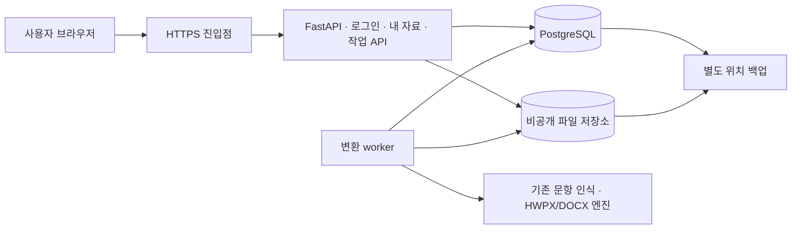

# HWP Make 웹 서비스 전환 기획

작성일: 2026-09-07 · 상태: 구현 전 제안 · 기준: 현재 코드와 2026-09-05 개선 기록

## 1. 제품 목표와 첫 출시 범위

교사·강사가 시험지 파일을 업로드하고, 편집 가능한 HWPX를 받아 자신의 한글에서 검수·수정할 수 있는 웹 서비스를 만든다. 핵심 약속은 **내 자료만 보이고, 오래 걸리는 변환은 창을 닫아도 계속되며, 결과와 주의사항을 나중에 다시 확인할 수 있다**는 것이다.

첫 출시는 초대 사용자 10~30명의 비공개 베타로 가정한다. 이는 모집 규모이며 동시 변환 수용량을 검증한 수치가 아니다. 결제와 공개 가입은 베타 이후 판단한다. 사용자·보관 기간·용량의 아래 수치는 구현을 구체화하기 위한 제안값이다.

| 구분 | 베타에서 제공할 것 |
| --- | --- |
| 주 사용자 | 디지털 시험지 PDF를 HWPX로 변환하는 교사·강사 |
| 기본 경로 | 로그인 → 파일 업로드 → 변환 접수 → 상태 확인 → 결과 검수·다운로드 |
| 주 입력·출력 | 텍스트가 포함된 PDF → 편집 가능한 HWPX |
| 고급 경로 | PDF/HWP/HWPX/DOCX/TXT 가져오기 → 내 문항 편집·선택 → HWPX/DOCX 생성 |
| 이용 환경 | PC 중심, 모바일에서는 업로드·상태 확인·다운로드 지원 |
| 초기 제한 | 파일 20MB·PDF 50쪽, 사용자당 실행 1개·대기 2개, 하루 변환 10회, 보관 500MB |
| 이후 검토 | 스캔/OCR 정식 지원, 사용자별 AI 연결, 조직 공동 문항함, 결제, 공개 가입 |

직접 `.hwp` 저장, 브라우저에서 한글 수준의 문서 편집, 모든 문서의 완벽한 원본 재현은 이번 출시 범위에 넣지 않는다. 웹 수집·SQLite/CSV 가져오기·이미지 OCR은 베타 지원 범위 밖으로 두고 웹 API에서도 차단한다. 단순히 메뉴만 숨기지 않는다.

## 2. 현재 근거와 보존할 기능

- 현재 `app/main.py`는 화면·API·파일 서빙을 담당한다. 문항·결과·AI 설정에 사용자 인증과 소유권 검사가 없다.
- `app/storage.py`는 공용 SQLite DB와 uploads/exports 디렉터리를 사용한다. 파일 공개 마운트를 소유권 검사 경로로 바꿔야 한다.
- 변환 슬롯 2개와 내보내기 잠금은 프로세스 내부에서만 유효하다. 서버 전체의 영속 대기열은 없다.
- 9월 5일 개선에서 누락 문항 차단, 혼잡 429 응답, 실패 파일 정리, PDF 전체 유형 보존, 결과 검수 메타데이터 연결을 구현했다. 이를 웹 전환 중 유지한다.
- 같은 기록의 실물 PDF는 원본 40쪽·92문항을 출력 40쪽·92문항으로 보존했고 변환·검수에 363.33초가 걸렸다. 이는 특정 로컬 샘플 측정이며 웹 성능 보장이 아니다.
- rhwp 미리보기의 다단 제약과 실제 한글 편집 안전성 검증은 남아 있다. 그림 배치 경고를 포함한 기존 검사 전체가 통과했다고 표시하지 않는다.

근거: [변환 개선 기록](audits/2026-09-05/conversion-improvements.md), [API](../app/main.py), [저장소](../app/storage.py), [미리보기](../app/preview.py). 과거 자체평가 점수는 웹 출시 판정으로 사용하지 않는다.

## 3. 사용자 경험

### 홈: 새 변환과 내 작업

로그인 후 첫 화면에는 파일 추가와 내 최근 작업을 둔다. 파일을 고르면 파일명·용량·PDF 쪽수·보관 기한을 표시한다. 기본은 전체 페이지·전체 유형 보존이다. 축약 기능은 고급 옵션으로 두고, 제외 범위를 확인하기 전에는 접수하지 않는다.

변환 버튼을 누르면 중복 접수를 막고 작업을 등록한다. 업로드 완료와 변환 완료는 별개로 표시한다. 업로드 도중 창을 닫으면 접수가 완료되지 않을 수 있으며, 접수 후에는 창을 닫아도 처리된다.

### 작업 상세: 상태와 복구

화면에는 `업로드 중 → 대기 중 → 변환 중 → 결과 검사 중 → 완료`를 표시한다. 실제 엔진이 페이지 진행량을 제공할 때만 `12/40쪽`처럼 표시하며 임의의 진행률이나 남은 시간을 만들지 않는다. 새로고침·재로그인 시 서버의 작업 상태를 복원한다.

대기 작업은 즉시 취소할 수 있다. 실행 중 작업은 `취소 요청됨`으로 표시하고 서버가 중단을 확인한 후 `취소됨`으로 바꾼다. 브라우저의 요청 대기 중단을 서버 작업 취소로 표시하지 않는다.

실패 화면은 원인, 원본 유지 여부, 재시도 가능 여부를 남긴다. 예: 지원하지 않는 형식, 페이지 제한 초과, 처리시간 초과, 결과 생성 실패. 같은 입력을 바꾸지 않으면 해결되지 않는 실패는 자동 재시도하지 않는다.

### 결과: 받기와 검수

결과 카드에는 원본명, HWPX 받기, 포함 페이지·문항 수, 확인이 필요한 항목, 미리보기, 삭제·만료일을 표시한다. 문항 수를 확인하지 못한 경우 `미확인`으로 표시한다. 구조·파일 검사 실패는 다운로드 가능한 정상 완료로 게시하지 않는다.

파일 생성 성공과 품질 검수 통과를 분리한다. 수식·표의 이미지 대체, 다단 미리보기 제한 등은 결과 옆에서 설명한다. 내부 품질 점수를 그대로 “정확도 99%” 같은 사용자 보증으로 변환하지 않는다.

### 고급 편집과 관리자

기존 스튜디오를 `문항으로 편집` 경로로 유지한다. 내 문항만 검색·편집하고, 내보내기를 접수할 때 선택 순서와 내용을 고정한다. 접수 뒤 원본 문항을 수정해도 진행 중 결과는 바뀌지 않는다.

관리자 화면은 사용자 초대·이용 정지, 작업 상태·실패 사유, 저장 용량·대기열을 제공한다. 관리자에게 사용자 문서 본문 열람 권한을 기본 부여하지 않는다. 문서 문의는 사용자가 작업 ID를 전달하는 흐름으로 시작한다.

## 4. 권장 배포 구조

기존 정적 화면과 FastAPI를 유지한다. 베타는 Linux 단일 VM의 컨테이너 구성으로 시작하고 API와 변환 worker를 별도 프로세스로 운영한다. PostgreSQL은 사용자·문항·파일·작업 상태와 대기열을 맡고, 문서 바이트는 비공개 영구 볼륨에 보관한다. 백업은 다른 저장 위치로 보낸다.

FastAPI의 컨테이너 배포 방식을 적용하되 이미지·의존성 버전을 고정하고 자동 재시작·상태 점검을 구성한다. [공식 배포 문서](https://fastapi.tiangolo.com/deployment/docker/)

PostgreSQL 대기열은 짧은 트랜잭션에서 `FOR UPDATE SKIP LOCKED`로 작업을 선점하고, 변환 중에는 DB 잠금을 계속 보유하지 않는다. 이 기능은 큐 소비자 간 잠금 경합을 피하는 용도로 문서화되어 있다. 임대 만료·재시도·중복 결과 방지는 별도로 구현한다. [PostgreSQL SELECT 문서](https://www.postgresql.org/docs/current/sql-select.html)

파일 업로드는 Base64 JSON에서 multipart `UploadFile`로 옮긴다. 디스크로 넘길 수 있는 임시 파일 방식을 활용하되 본문 전체를 다시 메모리에 읽지 않고, 프록시와 실제 읽은 바이트 양쪽에 용량 제한을 둔다. [FastAPI 파일 업로드 문서](https://fastapi.tiangolo.com/tutorial/request-files/)

최초 worker 동시 실행은 1개, 전체 대기는 20개로 제한한다. 단일 작업의 메모리·CPU와 동시 2개 실행을 측정한 뒤 늘린다. VM 사양·제공사·월 비용은 이 측정과 사용자 예산을 바탕으로 선택하며, 이 기획으로 구매·배포를 실행하지 않는다.

## 5. 인증·데이터·파일 계약

### 계정과 접근 제어

- 초대된 계정만 이용한다. 검증된 OIDC 로그인 연동을 쓰고 공급자 선택은 구현 착수 시 정한다. 서버 세션 쿠키에 Secure·HttpOnly·SameSite를 적용하고 변경 요청의 CSRF/Origin을 검증한다.
- 모든 데이터 조회·수정·삭제·작업 접수는 서버 세션의 사용자 ID로 범위를 정한다. 요청 본문에 들어온 소유자 ID를 신뢰하지 않는다.
- 파일 이름을 알아도 남의 원본·이미지·미리보기·리포트·결과를 받을 수 없어야 한다. `/files/uploads`, `/files/exports` 공개 마운트를 제거하고 파일 ID 기반 인증 다운로드로 대체한다.
- AI는 웹 베타에서 기본 비활성화한다. 기존 공용 키 설정 변경·OCR·재구성 API는 차단하며 관리자 키가 로컬 환경에서 우연히 활성화되지 않게 명시적인 웹 설정을 둔다.
- 로그아웃·계정 전환 시 문항 본문·선택 목록·캐시를 비운다. 브라우저 저장 키를 사용자별로 나누고 개인 API·파일에는 공유 캐시를 허용하지 않는다.

### 최소 데이터 모델

| 엔티티 | 주요 내용 |
| --- | --- |
| users / sessions | 로그인 공급자와 subject, 역할, 사용 가능 상태, 세션 만료 |
| problems | owner_id, 기존 문항 내용, revision, 콘텐츠 해시 |
| files | owner_id, 용도, 저장 키, 원본명, 해시, 크기, 만료·삭제 상태 |
| jobs | owner_id, 종류, 상태, 입력 스냅샷, 옵션, 시도 수, 임대 토큰·기한, 오류·시간 |
| job_outputs | 작업·파일 연결, 보존 범위, 검수 결과, 결과 게시 상태 |
| file_references | 저장된 문항이 참조하는 이미지·첨부와 그 소유자 |
| usage / audit_events | 사용자별 예약·실사용량, 관리 변경 및 작업 상태 이력 |

중복 문항 탐지는 사용자 범위 안에서만 한다. DB 참조 제약과 API 검사를 함께 적용해 다른 사용자의 파일 ID·문항 ID가 작업 입력이나 첨부로 연결되지 않게 한다.

기존 로컬 DB는 그대로 공개 서버에 올리지 않는다. 백업·dry-run 후 지정한 한 소유자에게만 선택 자료를 이관하고 행 수·파일 해시·참조를 대조한다. API 키 설정과 과거 생성물은 자동 이관하지 않는다. 로컬 SQLite 실행 경로는 유지하며 웹 PostgreSQL은 저장소 계층으로 분리한다.

### 보관 정책 제안

- 임시 업로드는 24시간, 작업 원본은 종료 후 7일, 결과·검수 이미지는 종료 후 30일 보관한다. 진행 중 작업은 만료 정리 대상에서 제외한다.
- 사용자가 문제은행에 저장한 문항과 그 참조 이미지는 사용자 삭제 전까지 보존하고 500MB 한도에 포함한다. 작업 만료로 문항의 이미지를 지우지 않는다.
- 삭제 요청 시 접근을 즉시 막고 실제 파일 정리는 24시간 이내 완료한다. 실행 중 입력 삭제는 취소 확인 후 처리하며 공유 참조를 검사한다.
- 하루 1회 DB·파일을 일관된 상태로 백업하고 7일 보관한다. 삭제 데이터가 백업 만료까지 남는 점을 안내하고 복구 시 삭제 이력을 재적용한다.
- 예약 용량·변환 횟수는 원자적으로 계산한다. 중복 접수는 한 번만 차감하고 서버 내부 실패·실행 전 취소는 횟수를 반환한다.

## 6. 작업 처리와 API 초안

`queued → running → validating → succeeded`를 기본으로 `failed`, `cancel_requested`, `cancelled`를 관리한다. `succeeded` 결과에 별도 검수 주의 표시를 허용한다. 파일 게시 전에 검사와 메타데이터 저장을 완료한다.

worker는 주기적으로 임대를 갱신한다. 각 실행에 attempt ID와 전용 작업 디렉터리를 부여하고 현재 임대 토큰을 가진 실행만 결과를 게시한다. 서버 재시작으로 같은 작업이 다시 실행되어도 결과·문항 등록이 중복되지 않도록 게시와 import 반영을 멱등 처리한다.

프로세스 중단 등 일시 장애만 1회 자동 재시도한다. 작업 실행 제한은 우선 20분으로 두고 검증 샘플에 따라 조정한다. worker가 실행별 자식 프로세스를 관리해 취소·시간 초과 시 실제 연산을 끝내고 부분 파일을 정리한다. 원본과 성공 결과는 부분 파일과 분리한다.

| API | 계약 |
| --- | --- |
| `GET /api/me` | 계정·권한·잔여 한도 |
| `POST /api/uploads` | multipart 업로드, 형식·크기 검증, 내 file_id 반환 |
| `POST /api/jobs` | 종류·내 입력 ID·옵션, Idempotency-Key로 중복 방지, 202와 job_id 반환 |
| `GET /api/jobs` | 내 작업 목록·페이지네이션 |
| `GET /api/jobs/{id}` | 내 작업 상태·확인 가능한 진행량·오류·결과 |
| `POST /api/jobs/{id}/cancel` | 취소 접수, 현재 상태에 맞는 멱등 응답 |
| `POST /api/jobs/{id}/retry` | 재시도 가능한 내 작업에서 새 작업 생성, 입력 보존·한도 확인 |
| `GET /api/files/{id}/download` | 소유권·삭제·만료 확인 후 스트리밍 |
| `DELETE /api/files/{id}` | 참조·진행 중 작업 확인 후 삭제 처리 |

초기 상태 조회는 화면이 활성화되어 있을 때 2초 간격으로 시작하고 대기·오류 시 간격을 늘린다. 업로드가 끝난 뒤 job_id를 잃어도 내 작업 목록에서 찾을 수 있다. 초과 요청에는 429와 재시도 안내를 제공한다.

기존 import/export/preview/PDF 변환은 공통 서비스 함수로 추출해 웹에서는 작업 API를 사용한다. 과거 동기 API·AI API·수집 API가 인증이나 자원 제한을 우회하는 통로로 남지 않게 웹 모드에서 제거 또는 차단한다. 미리보기에도 같은 작업 자원 예산을 적용한다.

## 7. 개발 순서와 완료 조건

| 단계 | 작업 | 완료 조건 |
| --- | --- | --- |
| 0. 서버 실행 검증 | 고정 버전 Linux 이미지, 글꼴·rhwp·PDF 의존성, 테스트 데이터 경로 분리 | 새 환경에서 실행하고 지원 샘플 변환·한글 열기 확인. 실패 의존성 및 사용 가능한 글꼴 확인 |
| 1. 내 자료 보호 | 로그인, PostgreSQL 저장소, 소유권, 비공개 파일, 계정 전환 처리 | A/B 계정 교차 조회·수정·삭제·파일·작업 입력 접근이 모두 차단 |
| 2. 지속되는 변환 | 업로드, 작업 DB, worker, 취소·재시도, 한도, 멱등 처리 | 창 닫기·서버 재시작·worker 강제 종료·중복 클릭 후 상태와 결과 일관성 유지 |
| 3. 결과 경험 | 홈·작업 상세·내 결과, 검수 안내, 스튜디오 연결 | 업로드부터 재로그인 후 다운로드까지 PC·모바일 핵심 흐름 완료 |
| 4. 운영 검증 | HTTPS, 백업·복구, 만료·삭제, 로그, 부하 측정 | 아래 출시 관문을 통과하고 별도 테스트 환경에서 복구 시연 |
| 5. 비공개 베타 | 소수 초대부터 시작해 10~30명으로 확대 | 실패·불편·사용량 기록으로 지원 범위와 한도 조정 |

각 단계는 이전 단계의 완료 조건을 확인한 후 진행한다. 일정은 0단계에서 배포 의존성과 저장소 변경량을 확인한 뒤 산정한다. 웹 기능 개발로 수식·페이지 보존 회귀를 허용하지 않는다.

## 8. 출시 관문과 측정

아래 값은 목표이며 현재 달성한 수치가 아니다.

- **격리:** 두 계정의 문항·파일·리포트·작업·브라우저 복원에서 교차 접근 0건. 비로그인으로 개인 데이터 접근 0건.
- **복구:** 변환 중 API/worker 재시작, 임대 만료, 중복 접수, 게시 직전 취소를 주입해 중복 결과·중복 문항·영구 실행 중 상태 0건.
- **문서 보존:** 합의한 지원 샘플 전부에서 선택 페이지·문항 inventory 일치. 알 수 없는 항목은 경고하고, 수식·그림 검사 충돌을 무조건 통과로 바꾸지 않음. 대표 결과는 실제 한글에서 열기·편집·저장 확인.
- **품질 회귀:** 기존 conversion_integrity·API hardening·PDF export 검증을 새 구조에 맞춰 실행하고, 지원 범위의 실물 샘플과 화면 흐름을 확인. 외부 샘플 없는 SKIP을 PASS로 집계하지 않음.
- **성능:** 10개 로그인 세션과 대기 작업이 있는 상태에서 일반 목록·상태 API p95 1초 이내, 업로드 완료 뒤 작업 접수 p95 2초 이내를 목표로 측정. 변환은 입력 종류·쪽수별 대기시간과 실제 처리시간을 따로 보고한다.
- **자원:** 20MB·50쪽 경계 입력과 동시 1/2개 실행에서 최대 RAM·CPU·임시 디스크 사용량 측정. 메모리 부족 종료나 디스크 고갈이 발생하면 한도·동시성을 낮추고 재검증.
- **운영:** 삭제·만료된 파일의 다운로드 차단, 참조 이미지 보존, 백업 복구 확인. 베타 복구 목표는 데이터 손실 최대 24시간·서비스 복구 4시간이며 실제 연습 결과로 조정.

베타에서는 로그인→업로드→접수→생성→다운로드 비율, 실패 원인, 재시도율, 검수 경고율, 처리시간, 사용자당 저장량을 수집한다. 문서 본문과 API 키는 로그에 남기지 않는다. 다운로드 성공을 사용자의 최종 품질 만족으로 간주하지 않고 결과별 피드백을 받는다.

## 9. 다음 실행 항목

첫 구현 묶음은 **서버 실행 검증 + 로그인·소유권 설계 + 비공개 다운로드 전환**이다. 이후 작업 대기열을 붙이고 화면을 연결한다. 서비스 제공사·도메인·예산·로그인 공급자는 배포 환경을 정할 때 선택한다. 기존 엔진을 재작성하거나 공개 배포부터 시작하지 않는다.
